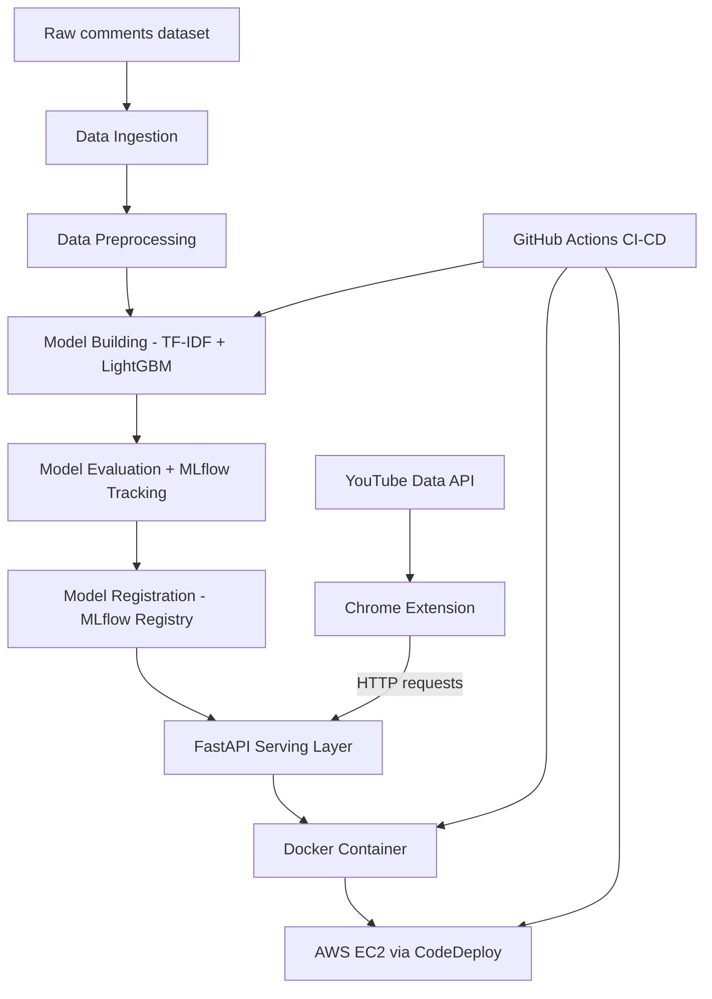

# YouTube Comment Sentiment Analysis

An end-to-end MLOps project that analyzes the sentiment (positive / neutral / negative) of YouTube video comments, served through a REST API and consumed by a Chrome extension — with a fully automated CI/CD pipeline deploying to AWS.

> Built from the ground up as a personal learning project, inspired by a CampusX tutorial. Every component below — the ML pipeline, the API, the Docker container, the AWS infrastructure, the CI/CD pipeline, and the Chrome extension — was implemented, tested, and deployed independently.

---

## Features

- **Sentiment classification** of YouTube comments using a TF-IDF + LightGBM model
- **Reproducible ML pipeline** (data ingestion → preprocessing → training → evaluation → registration) managed with DVC
- **Experiment tracking & model registry** with MLflow (alias-based promotion: `staging` → `production`)
- **REST API** (FastAPI) exposing prediction, pie chart, word cloud, and sentiment-trend endpoints
- **Containerized** with Docker for consistent, portable deployment
- **Fully automated CI/CD** with GitHub Actions: on every push, the pipeline retrains, tests, builds, and deploys to AWS
- **Chrome extension** that fetches live comments from any YouTube video (via the YouTube Data API) and visualizes their sentiment directly in the browser

---

## Architecture



The pipeline is orchestrated end-to-end with a single command (`dvc repro`), and every push to `main` triggers GitHub Actions to retrain, test, containerize, and redeploy automatically.

---

## Tech Stack

| Layer | Tools |
|---|---|
| Language | Python 3.12 |
| Data & ML | pandas, scikit-learn, LightGBM, NLTK |
| Pipeline & tracking | DVC, MLflow |
| API | FastAPI, Uvicorn |
| Visualization | Matplotlib, Seaborn, WordCloud |
| Containerization | Docker |
| CI/CD | GitHub Actions |
| Cloud | AWS (EC2, ECR, CodeDeploy, S3, IAM) |
| Frontend | Chrome Extension (Manifest V3, vanilla JS) |

---

## Project Structure

```
├── data/                    # raw, interim, and processed datasets (DVC-tracked)
├── src/
│   ├── data/                # data_ingestion.py, data_preprocessing.py
│   └── model/                # model_building.py, model_evaluation.py, register_model.py
├── fastapi_app/
│   └── app.py                # serving API: predict, chart, wordcloud, trend endpoints
├── chrome-extension/
│   ├── manifest.json
│   ├── popup.html / popup.js
│   └── config.example.js     # copy to config.js and add your own API keys
├── scripts/
│   ├── test_load_model.py
│   ├── test_model_signature.py
│   ├── test_model_performance.py
│   └── promote_model.py      # promotes a model from staging to production alias
├── deploy/scripts/            # CodeDeploy ApplicationStop / ApplicationStart hooks
├── infra/                     # IAM policy documents, EC2 bootstrap script
├── .github/workflows/cicd.yaml
├── dvc.yaml                   # 5-stage reproducible pipeline definition
├── Dockerfile
├── appspec.yml                # CodeDeploy deployment spec
├── params.yaml                # pipeline hyperparameters
└── requirements.txt
```

---

## Getting Started (Local Development)

### 1. Clone and set up the environment

```bash
git clone https://github.com/Sanaullahkhan10/youtube-comment-analysis.git
cd youtube-comment-analysis
python -m venv venv
venv\Scripts\Activate      # Windows
pip install -r requirements.txt
```

### 2. Run the full ML pipeline

```bash
dvc repro
```

This downloads the raw data, cleans it, trains the model, evaluates it, and registers it in MLflow — reproducing every stage from scratch.

### 3. Run the API locally

```bash
python fastapi_app/app.py
```

Visit `http://127.0.0.1:5000/docs` for interactive API documentation.

### 4. Run with Docker

```bash
docker build -t yt-sentiment-app .
docker run -p 5000:5000 yt-sentiment-app
```

---

## Chrome Extension Setup

1. Copy `chrome-extension/config.example.js` to `chrome-extension/config.js`
2. Add your own [YouTube Data API v3 key](https://console.cloud.google.com/) and your API's base URL
3. Go to `chrome://extensions`, enable **Developer mode**, click **Load unpacked**, and select the `chrome-extension/` folder
4. Open any YouTube video and click the extension icon to see comment sentiment, a pie chart, a word cloud, and a sentiment trend graph

---

## CI/CD Pipeline

Every push to `main` triggers `.github/workflows/cicd.yaml`, which:

1. Reproduces the DVC pipeline (retrains if data/code/params changed)
2. Runs the unit test suite (model loading, prediction signature, minimum performance thresholds)
3. Promotes the model from the `staging` to the `production` MLflow alias
4. Builds and pushes a Docker image to AWS ECR
5. Triggers an AWS CodeDeploy deployment, which pulls the new image onto the EC2 instance and restarts the container

---

## AWS Infrastructure

| Resource | Purpose |
|---|---|
| IAM (least-privilege user) | Scoped permissions for CI/CD — no standing IAM management access |
| ECR | Stores built Docker images |
| EC2 (with Elastic IP) | Runs the live API container |
| CodeDeploy | Orchestrates zero-touch deployments from GitHub Actions |
| S3 | DVC remote storage + deployment artifacts |
| AWS Budgets | Zero-spend alert + automatic EC2 shutdown action as a cost safety net |

---

## Acknowledgments

Architecture and problem framing inspired by a CampusX MLOps tutorial. All code, infrastructure, and the Chrome extension in this repository were independently built, adapted, and deployed to a personal AWS account.
